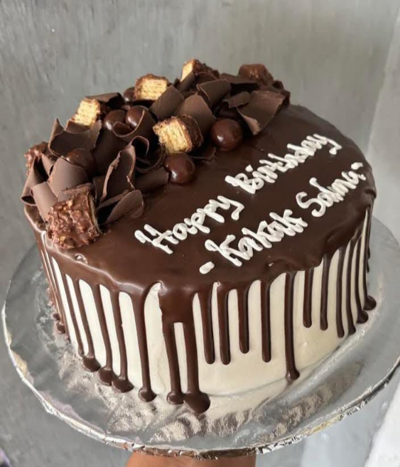

# destydonuts
brownies tart
<!DOCTYPE html>
<html lang="id">
<head>
  <meta charset="UTF-8">
  <meta name="viewport" content="width=device-width, initial-scale=1">
  <title>Brownies Tart</title>
  
</head>
<body>
  

    
    <h1>BROWNIES TART</h1>
    
Bentuk, model, warna, tema dan topping sesuai pesanan customer. Harga tergantung diameter dan kerumitan, dan topping, bisa membawa contoh sendiri.

    
📍 Free lilin

    <a href="#" class="btn">Pesan Sekarang</a>
    <footer>&copy; 2025 Brownies Tart. All rights reserved.</footer>
  

</body>
</html>
